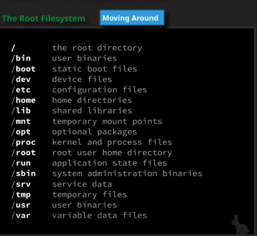

# files and directories

FHS - filesystem heirarchy standard

OS will put a file system on the hard drive

    cd /

This is the root. This is the top of the file system.

This is the drive level.

    /bin

These are user binaries or commands that can be used by the user.

example: pwd or ls

    /boot

static boot files necessary to boot the linux system

    /dev

device files

    /etc

configuration files

for example the apache configuration files will be here

    /home

user home directories

    /lib

libraries

    /mnt

will show temporary mounts

    /opt

optional packages

    /proc

kernel processes and files

You can see the cpu info by seeing

    cat /proc/cpuinfo

    /root

This is the root's home directory

    /run

application state files

    /sbin

system administration binaries

binaries used by root for sys admin work

    /srv

service data

    /tmp

temp directory - non persistent

    /usr

user binaries like /bin

    /var

variable data files

## common commands to move around

    pwd

    cd

Use tab completion (hit tab two times)

    cd -

last directory

    cd ..

one level up

    cd ../..

two levels up

---

inode is the physical location where the file lives

## hidden files and directories

files and directories that are hidden from basic listing

    ls -a

in the gui

    control + h

this will show you hidden files

these are not secret that is related to permissions

the main purpose is to not clutter the view

you can also make hidden directories

    mkdir .hidden_subdir

you can use

    ls -A

also as this is almost all excludes the . and the ..

## home directories in linux

these contain the user's files.

this is a dedicated place for a user's files.

    cat /etc/passwd

this is where all the users are listed.

this file will also show the home directory of users.

    /etc/passwd

is the master mapping on a linux system.

upon login we are going to be in the home directory.

you can touch files outside also.

Look at environment variables

    env

    HOME is an environment variable

so we can do

    cd $HOME

to go to the home directory as well

## absolute and relative paths

a path is a unique location of a file or directory

    cat /home/cloud_user/file1

or if you are in 

    /home/cloud_user

you can do

    cat file1

the first is an absolute path and the second is a relative path.

This is also interesting

    ./file1

is the same as

    file1

### how to use ls to list files sorted by size

I figured out from the man pages that there is an -S option for sort

but i guess you can just do

    ls -S

combine that with l and h also for long and human readable

    ls -Shl

### ls option for access time

    -u

---

**Making a directory**

    mkdir test2

To copy a directory

    cp -R test2 test3

Copy the contents of the directory as well.

**Moving a directory**

    mv testdir2 /tmp/

This is also used to rename a directory.

**Deleting a directory**

    rm dir2

    rm -r dir2

This is the recursive option.

**Creating a new file**

    touch newfile

This either changes the timestamp or it creates a new empty file.

    file

The file command determines the file type.

    cat

Printing out a file.

    mkdir -p parentdir/childdir/anotherdir

This will create all the directories.

**Some options for copy**

    -i

This will ask you before overwriting.

    -s

Create a symbolic link instead of a copying a file.

    -v

Verbose option.

## Case sensitivity

ext4 is a case sensitive file system.

## Simple globbing

What is globbing?

Using partial matching to work with groups or sections of files.

Used to match patterns using a wild card character.

Create four files

    touch file1 file2 file3 file4

    ?

Matches any single character.

    file?

This will return file1 file2 file3 file4

    ?????

Every file that is five characters long will be returned.

    ????

This will reurn 4 characters long.

    ????1

Four characters long and ending in 1.

The next way is with

    *

This will match 0 to any number.

    ls file*

This will give all results like file1 file2 file3 file4

    ls *

is the same as ls.

    ls *4

This will return file4.

Brackets:

    []

    ls ????[1-3]

A file with any first four characters  but that ends in 1, 2, or 3.

    ls *[:digit:]

This will give us anything that ends in a digit.

Use double brackets with this

    ls *[[:digit:]]

The choices you have here are:

    [[:upper:]]

[A-Z]

    [[:lower:]]

[a-z]

    [[:digit:]]

[0-9]

    [[:alpha:]]

[a-zA-Z]

    [[:alphanum:]]

[a-zA-Z0-9]
