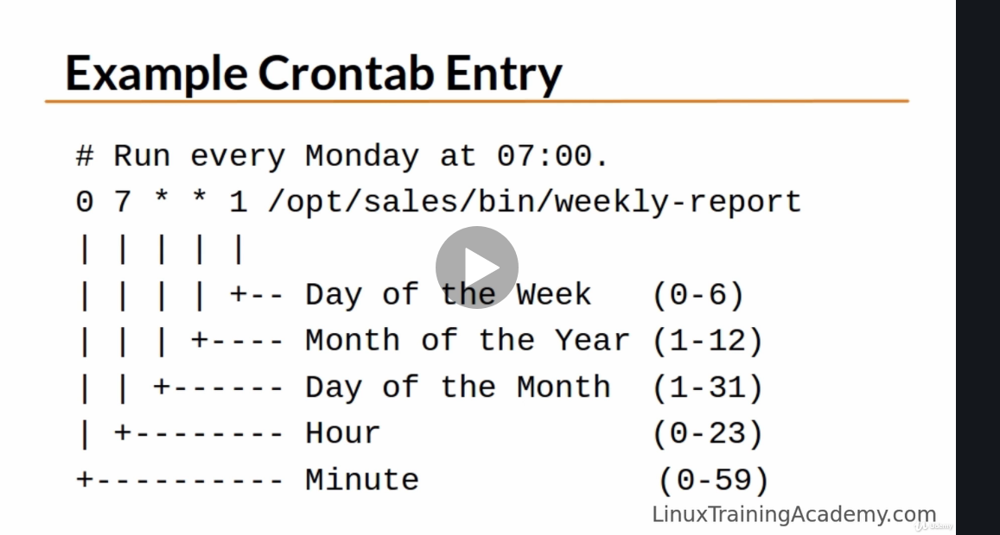
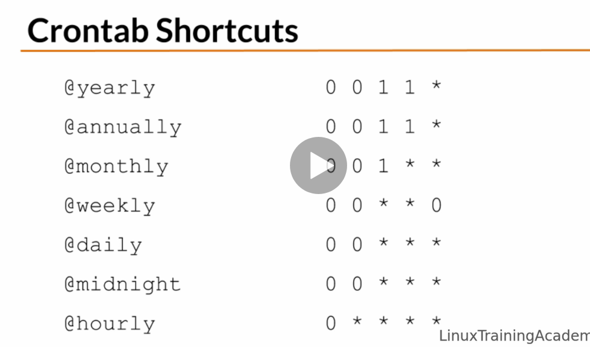

# Scheduling repeated jobs with cron

crontab is a configuration file that specific when commands are to be run.

### Run every monday at 07:00AM

	0 7 * * 1 /opt/sales/bin/weekly-report

The format is

	week
	month
	day
	hour
	minute

### Output is generally sent to your email but you can also do the following if you don't want email

Run at 02:00 every day and send output to a log file.

	0 2 * * * /root/backupdb > /tmp/db.log 2>&1

### Run a command every 15 minutes

In this there are multiple arguments for the first field, which is minutes.

	0,15,30,45 * * * * /opt/acme/bin/15-min-check

### Another way to do the same thing

	*/15 * * * * /opt/acme/bin/15-min-check

### Running for the first 5 minutes of the hour

	0-4 * * * * /opt/acme/bin/first-five-mins

	@yearly means to run once a year at mid night on the morning of January 1st

	@annually is the same thing

	@monthly means run once a month at midnight on the morning of the first day of the month

	@weekly means run once a week at midnight on the morning of Sunday

	@daily run everyday at midnight

	@midnight is the same thing as daily

	@hourly run once an hour at the beginning of the hour

## Using the crobtab command

	crontab file

Install a new crontab from file.

	crontab -l

List your cron jobs.

	crontab -e

Edit your cron jobs.

	crontab -r

Remove all your cron jobs.

---

## Demo

	crontab -l

List all the cron jobs.

---

Creating a cron job

	vi my-cron

In the cron file lines that begin like this

	# This fill will run job at 7 am

is a comment

These lines will be ignored in shell scripts and by cron.

### Installing that cron

	crontab filename

	crontab my-cron

### Edit the crontab

	crontab -e 

### Disable cron job

Either commen it out in the cron file

Or

	crontab -r

Then you can list the cron jobs again by

	crontab -l

to make sure it has been removed.
