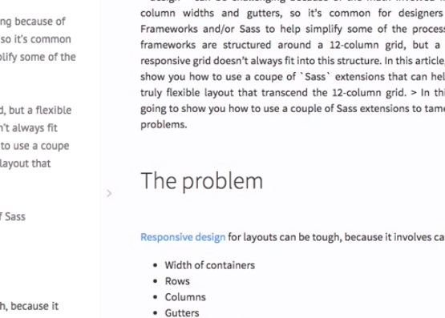

# This is my second note

# Headline level 1

## Headline level 2

### Headline level 3

Trying to learn markdown to take better notes.

This is how you write some code

    ls -la

for a long listing.


To break this sentence right here  

I will need to do this.

Does this break the line

does it?

This is how you create a headline
=================================

And this is a level 2 headline
-------------------------------

And now let's try my favorite a horizontal rule

---

This is below the rule 


This is a list

* item 1
* item 2
  * Here is a sub list item
    * Another one?
* item 3

## Links

### In line links

[responsive design](http://www.google.com)

### Another way of doing links

www.google.com

// Just writing out the link also renders it in the same way as a link.

## Images

[sample image](images/sample_1.png)

Can we preview this?



# Let's understand GFM - git hub flavored modifications

* Ignores underscores - use asterisk \* instead
* Strikethrough ~~strike this~~
* [x] Task lists
* Auto hotlinking - autodetect a link
* Fenced codeblocks
* Tables


## Let's revise how to do code blocks

Just by using a tab we get to write code!

    <html>
        <head>
        </head>
        <body>
        </body>
    </html>

However, this is the GFM


```html
<html>
    <head>
    </head>
    <body>
        <ul>
            <li></li>
            <li></li>
            <li></li>
        </ul>
    </body>
</html>
```

# Tables

First header | Second header
------------ | -------------
first value | first value
second value | second value

